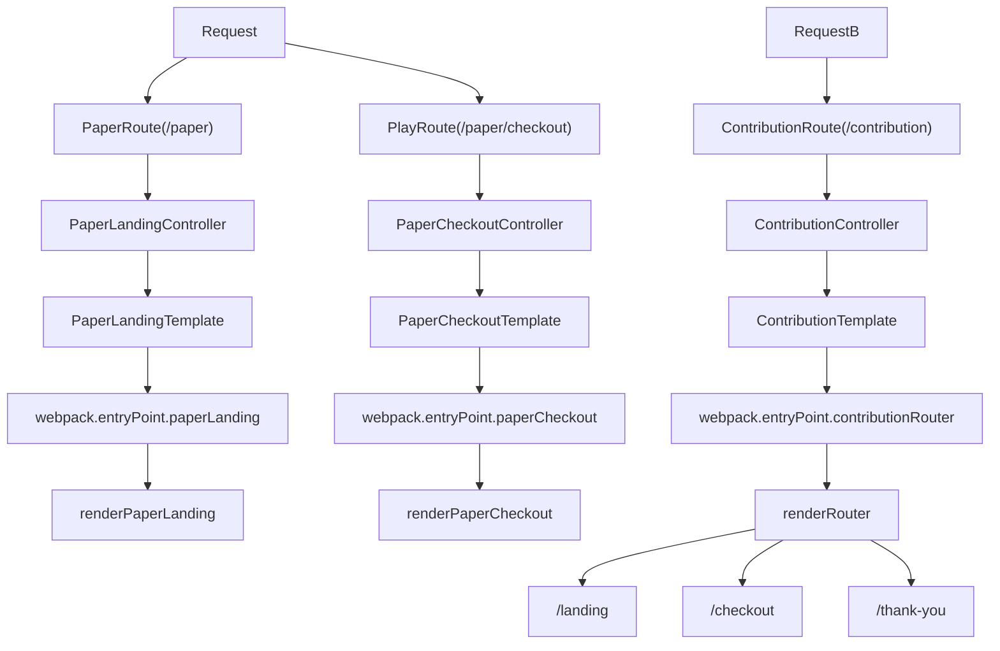

*Service:* support-frontend
*Status:* accepted

## Context

We need to be able to access a thank you page for the [generic checkout](https://github.com/guardian/support-frontend/issues/5722) to route to after purchase.

[Currently the generic checkout uses routing via Play framework][play-routes] [which][play-controller-render] [renders][play-html] a [`webpack.entryPoint`][webpack-entrypoint] for that [singular component][checkout-component].

We currently have multiple ways of doing this. Both introduce complexity at different level. This ADR aims to choose one, hopefuly leading to deprecating the other, and help with decision making in the future.

### Options

#### Create a `/thank-you` play route

This adds extra code and complexity at the `Request --> PlayApp --> PlayRoute` step.

This is what we do with paper products by separating the `FormController` from the `LandingPageController`.
e.g. [`PaperSubscriptionController` and `PaperSubscriptionFormController`](https://github.com/guardian/support-frontend/blob/b31dd3d73ad91313bac10e48a640d13d2656a264/support-frontend/conf/routes#L122-L123)

##### Drawbacks
- Maintains the need to context switch between Play and React when working on routing

#### Use react-router

This adds extra code and complexity at the `Request --> PlayApp --> PlayRoute --> PlayTemplate --> renderComponent` step.

This is what we currently do with [`supporterPlusRouter`](https://github.com/guardian/support-frontend/blob/b31dd3d73ad91313bac10e48a640d13d2656a264/support-frontend/assets/pages/supporter-plus-landing/supporterPlusRouter.tsx#L99-L142).

##### Drawbacks
- Potential for overloading the router and bloating the JS sent down the pipes. This could be mitigated via [code-splitting](https://v5.reactrouter.com/web/guides/code-splitting) or creating multiple routers.

## Decision
We are choosing to go with `react-router` as it feels like the complexity added is minimal and the need to switch between Scala/Play and React is minimised.

This is inline with the goals for the checkout reducing complexity and decrease time-to-change.

## Consequences

- The bundle size increases
- There more complexity in the request flow
- But less complexity in changing routes in future

[^1]: Current vs Proposed solution

---

[play-routes]: https://github.com/guardian/support-frontend/blob/b31dd3d73ad91313bac10e48a640d13d2656a264/support-frontend/conf/routes#L92-L93
[play-controller-render]: https://github.com/guardian/support-frontend/blob/b31dd3d73ad91313bac10e48a640d13d2656a264/support-frontend/app/controllers/Application.scala#L285
[play-html]: https://github.com/guardian/support-frontend/blob/b31dd3d73ad91313bac10e48a640d13d2656a264/support-frontend/app/views/checkout.scala.html#L24
[webpack-entrypoint]: https://github.com/guardian/support-frontend/blob/b31dd3d73ad91313bac10e48a640d13d2656a264/support-frontend/webpack.entryPoints.js#L3
[checkout-component]: https://github.com/guardian/support-frontend/blob/b31dd3d73ad91313bac10e48a640d13d2656a264/support-frontend/assets/pages/%5BcountryGroupId%5D/checkout.tsx#L620-L624