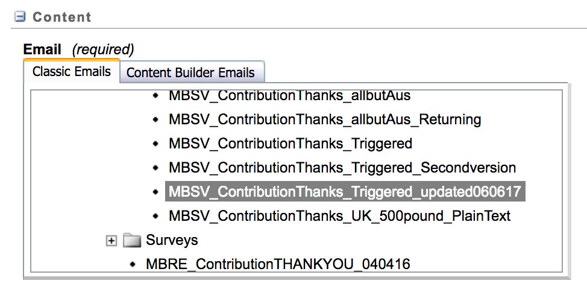

# Sending emails using Exact target and membership workflow
A number of projects such as contributions and support-workers use exact target to send emails. Document describes end to end how the systems work.

There are a number of elements involved:
* [Exact target](https://mc.s4.exacttarget.com/cloud/#app/Email) - Hosted service to create and send templated emails
* [Membership workflow](https://github.com/guardian/membership-workflow) - A scala app which continuously polls an SQS queue picking up any messages it finds there and triggering Exact target email from the data in them.
* Client applications - eg. support-workers. When client applications wish to send an email they post a message to the SQS queue mentioned above with a DataExtensionName attribute which determines which email to send.

Details of how to set up a new email are below.

## Exact target
Docs for triggered send are [here](
https://help.marketingcloud.com/en/documentation/exacttarget/interactions/triggered_emails/triggered_emails_guide/)

* [Sign in to Exact target](https://mc.s4.exacttarget.com/cloud/#app/Email/C12/Default.aspx?entityType=none&entityID=0%23Content)
* Change the 'context' to ‘Consumer’ from the drop down in the top right (it will probably say Guardian Admin when you log in)

There are two things that need to be set up:
#### Email Content
Select Content from the top menu to see these. Contributions emails can be found by expanding

_Shared items > Shared Emails > Membership > Contributor thank you > Final Thank You Versions_

in the left hand pane.

Create a new email here, the easiest way seems to be to use an existing template. If you have an email you want to duplicate you can save it as a template and then create a new email from that template.
#### Triggered send data extension
To see these from the top menu choose _Interactions > Triggered Emails_, then in the left hand pane expand

_Messages > Email > Triggered Sends_

You should then see all the triggered sends in the right hand pane, eg. 'Contributor Thank You - All regions'.
Create a new Triggered send by clicking on the _Create_ button and selecting _Create triggered send_.

Set up the triggered send by giving it a name, setting the 'Send classification' to 'Default transactional' and then picking the email you have just created in the  Content pane (see screenshot)

Finally, in order to trigger an email using membership workflow you will need to know the external id of the triggered send that you have just created.

To find this out you need to go back to the list of triggered sends and hover the mouse cursor over the link to the one your triggered send. The url that shows up in the bottom of the browser will contain the id as a querystring parameter 'ts'.

In the image below you can see that the 'Contributor Thank You - All regions' triggered send has the id 229c7f27-c98b-e611-906b-3c4a92f81d14

## Membership workflow
* New triggered send id in private.conf (exact-target.triggered-send-keys.my-key)
* New DataExtension in membership-common (DataExtension.scala)

## Client app
* Stick a message on the SQS queue with the following payload:

        {
          "To": {
            "Address": "$email",
            "SubscriberKey": "$email",
            "ContactAttributes": {
              "EmailAddress": "$email",
              "created": "$created",
              "amount": $amount,
              "currency": "$currency",
              "edition": "$edition",
              "name": "$name"
            }
          },
          "DataExtensionName": "$dataExtensionName"
        }
