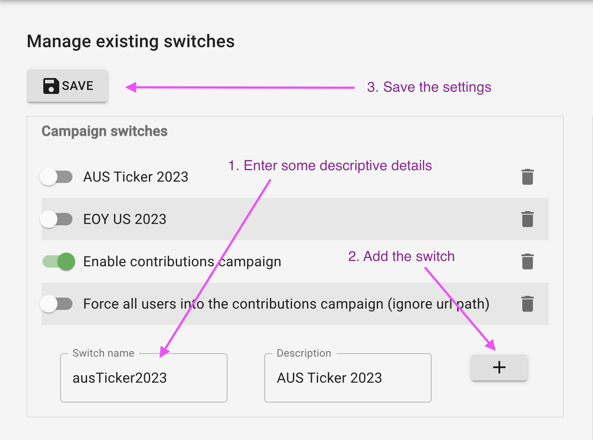

# Support Frontend
Frontend for the new [supporter platform](https://support.theguardian.com/).

## How tos

### How to SSM into EC2 servers
Use SSM Tunnel - [ssm-scala](https://github.com/guardian/ssm-scala#enabling-ssm-tunnel):

```Bash
ssm ssh --profile membership --tags frontend,support,CODE -a -x --newest --ssm-tunnel
```

---

### How to: Using campaign switches
We often run campaigns that have certain features or modifications to the site enabled.

To create a new campaign
1. Go to the [Reader Revenue Support Console switchboard](https://support.gutools.co.uk/switches)
1. Create a new switch under "Campaign switches"
1. Save the switchboard
1. Add the switch to [Switches.scala](./app/admin/settings/Switches.scala) under `CampaignSwitches` as
`switchName: Option[Switch] = None`



#### CODE / Local
To test in code, you would need to follow step 1. on
[the CODE switchboard](https://support.code.dev-gutools.co.uk/switches).

To test locally, copy the `switches_v2.json` file stored in S3 to the specified path in
[`DEV.public.conf`](./conf/DEV.public.conf) ie. `~/.gu/support-admin-console/switches_v2.json`.

```bash
# Make sure you have Janus credentials and `~/.gu/support-admin-console` exists
aws s3 cp s3://$SUPPORT_ADMIN_BUCKET/ENV/switches_v2.json  ~/.gu/support-admin-console/switches_v2.json --profile membership
```
